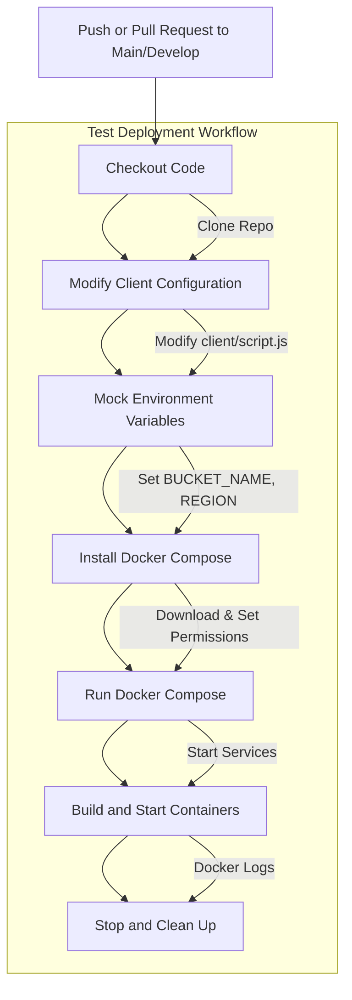
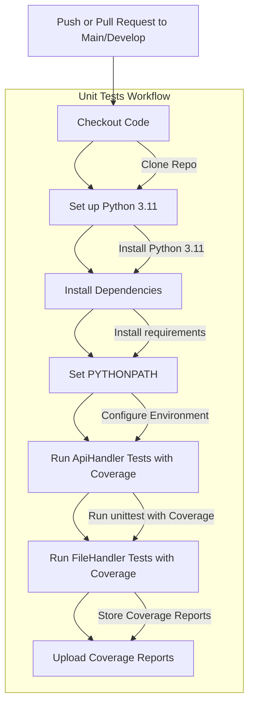

# Deployment Tests

**Workflow Name:** Test Deployment
This workflow is triggered on pushes to the main and develop branches and on pull requests to the main branch. It performs the following steps:

- Checkout Code: Clones the repository.
- Modify Client Configuration: Updates the client to accept localhost connections.
- Mock Environment Variables: Defines placeholders for bucket and region values.
- Install Docker Compose: Ensures the required version is available.
- Run Docker Compose: Starts all services using mocked environment variables.
- Build and Start Containers: Builds and runs the Docker containers, displaying logs for debugging.
- Stop and Clean Up: Shuts down and removes orphaned containers.

# Unit Tests

**Workflow Name:** Run Unit Tests
This workflow is triggered on pushes to the main and develop branches and on pull requests to the main branch. It performs the following steps:

- Checkout Code: Clones the repository.
- Set up Python: Installs Python 3.11.
- Install Dependencies: Installs required packages for API and file handlers.
- Set PYTHONPATH: Configures the environment for module discovery.
- Run Tests with Coverage: Executes tests for API and file handlers, generating coverage reports.
- Upload Coverage Reports: Saves the coverage reports as artifacts for further analysis.

